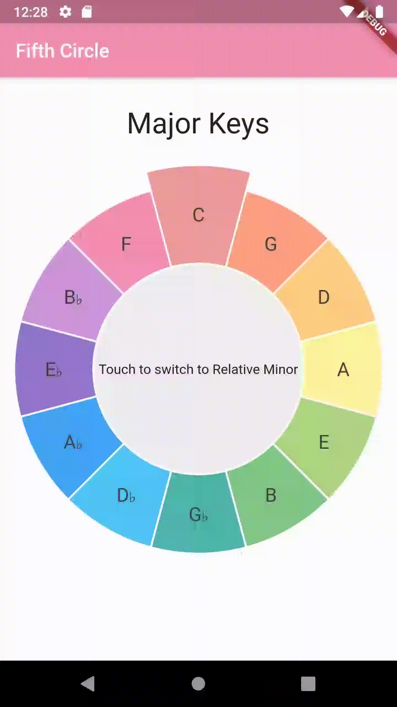

# fifthcircle

Circle of Fifths Application

## Getting Started

Simple App demonstrating basic Flutter features with the Circle of Fifths

Touch center to toggle between Major Keys and their corresponding Relative Minor

Touch Note sections to play audio for that note.

##Things/Features to do/add

- Add Application Icons
- Test in iOS
- Fix/Report gesture bug for right most section
- Add Themes - Dark, Color Shades etc.

